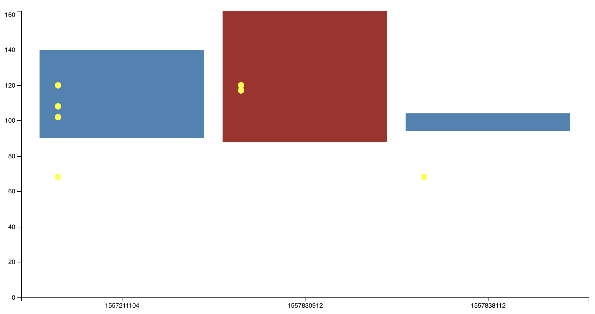

# Implementation of bar chart using d3 Version 5

## Data Structure

const data1 = [
  {
    diastolic_blood_pressure: 90,
    heart_rate: [102, 108, 120, 68],
    on_date: 1557211104,
    systolic_blood_pressure: 140,
  },
  {
    diastolic_blood_pressure: 88,
    heart_rate: [120, 117],
    on_date: 1557830912,
    systolic_blood_pressure: 162,
  },
  {
    diastolic_blood_pressure: 94,
    heart_rate: [68],
    on_date: 1557838112,
    systolic_blood_pressure: 104,
  },
]

## Preview

